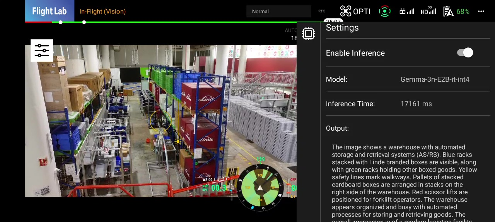

# Gemma3n Sample Android Application for Real-Time Drone Image Inference

This sample application demonstrates real-time inference using Gemma 3n running on an on-device receiving multimodal input of real-time images (and text) from a drone and then providing an explanation.



## Demo Video
You can watch the demo video of the application in action here:
https://youtu.be/Lbs22FLdV9A

## Download model

You can download the Gemma 3n model from the following link:
https://huggingface.co/google/gemma-3n-E2B-it-litert-lm/blob/main/gemma-3n-E2B-it-int4.litertlm

## Push model to Android device

You need to push the downloaded model to your Android device for on-device inference, As the model is too large to be bundled in an APK.

Use the following commands to do so:

```
$ adb shell rm -r /data/local/tmp/llm/ # Remove any previously loaded models
$ adb shell mkdir -p /data/local/tmp/llm/
$ adb push [local_path_to_the_model]/gemma-3n-E2B-it-int4.litertlm /data/local/tmp/llm/gemma-3n-E2B-it-int4.litertlm
```

For more details on deploying models for on-device LLM inference, please refer to the official MediaPipe documentation:
https://ai.google.dev/edge/mediapipe/solutions/genai/llm_inference/android#download-model


## Supported Drones
DJI Mavic 3TA，Matrice 400, DJI Matrice 4D, DJI Matrice 4TD, Matrice 4E, Matrice 4T, Matrice 350 RTK, DJI Mini 3 Pro, DJI Mini 4 Pro, DJI Mini 3, DJI Mavic 3M, DJI Mavic 3 Enterprise Series, Matrice 30 Series, Matrice 300 RTK

## Android Phone Requirements
As this application performs on-device inference, it is recommended to use an Android phone with good specs for optimal performance (We tested with Pixel 8 Pro).

## Note
Please do not fly drones in restricted areas and always follow local regulations and guidelines when operating drones.

Please do not use this sample application for commercial purposes without proper authorization, as the YOLOv8n model is subject to specific licensing terms.

As this is a sample application, we do not provide any guarantees regarding its performance, reliability, or suitability for any particular purpose. Use it at your own risk.

## Tested Devices
Pixel 8 Pro with DJI Mini 4

## Download
You can download the APK file from the Releases section of this repository: [Releases](https://drive.google.com/drive/folders/1oMPs09G7Py9hZridysevJCyQHVzOO0L6?usp=sharing)


## Link
https://deepmind.google/models/gemma/gemma-3n/
https://ai.google.dev/gemma/docs/gemma-3n

