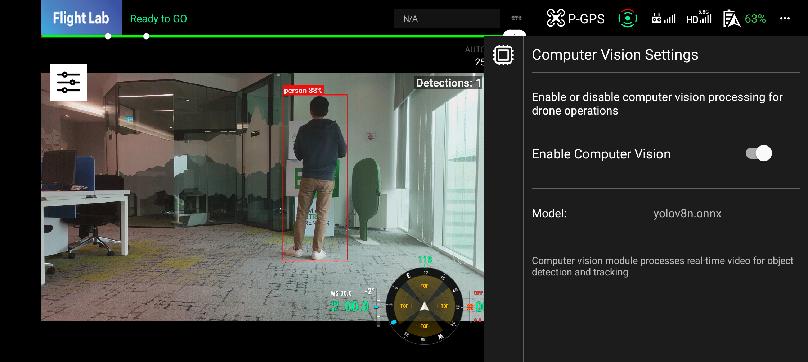

# Object Detection Sample using YOLOv8n

This sample application demonstrates real-time object detection using the YOLOv8n model with a DJI drone camera.

## Supported Drones
DJI Mavic 3TA，Matrice 400, DJI Matrice 4D, DJI Matrice 4TD, Matrice 4E, Matrice 4T, Matrice 350 RTK, DJI Mini 3 Pro, DJI Mini 4 Pro, DJI Mini 3, DJI Mavic 3M, DJI Mavic 3 Enterprise Series, Matrice 30 Series, Matrice 300 RTK

## Android Phone Requirements
As this application performs real-time object detection, it is recommended to use an Android phone with good specs for optimal performance

## Note
Please do not fly drones in restricted areas and always follow local regulations and guidelines when operating drones.

Please do not use this sample application for commercial purposes without proper authorization, as the YOLOv8n model is subject to specific licensing terms.

As this is a sample application, we do not provide any guarantees regarding its performance, reliability, or suitability for any particular purpose. Use it at your own risk.